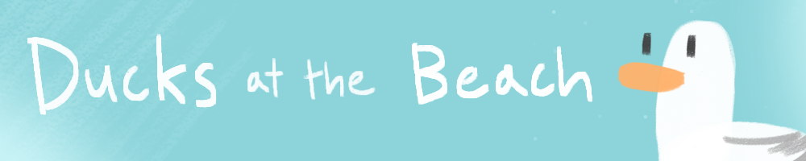
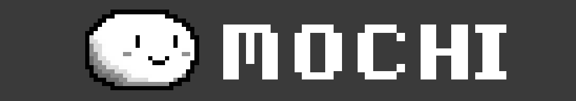

<h1 align="center">Hi, I'm <a href="https://danielholker.com/">Daniel Holker</a> 👋</h1>

I'm a Computer Science and Music graduate from McGill University. I like games.

<h2>Some stuff I've worked on...</h2>
   

  

   
  
  

   
  An online chatroom where players are ducks. 
  Front-end made in Unity; Back-end implemented using Node.js/Socket.io.  
  <a href="https://dpad46.itch.io/ducks-at-the-beach">Download here</a>
  

  

   
   

  

  

   
  
  

  

   
  A platformer created for a game jam. 
  Game shown at Unity Developer Day Montréal alongside others by GameDev McGill.  
  <a href="https://danielholker.com/mochi">Play here</a>
  

   
   
  

<table>
  <tr>
    <th> </th>
    <th> </th>
  </tr>
  <tr>
    <td align="center"><a href="https://github.com/Seibaah/The-Fresh-Game-Jam-2021">Cyberplane2077</a></td>
    <td align="center">Alteria</td>
  </tr>

  <tr>
    <th> </th>
    <th> </th>
  </tr>
  <tr>
    <td align="center">Bad Apple drawn in Kid Pix</td>
    <td align="center"><a href="https://github.com/UGL-McGill-2021/lionheart">Besunder<a></td>
  </tr>
</table>

  <h1></h1>
  

    <a href="mailto:daniel.holker@mail.mcgill.ca">📧 daniel.holker@mail.mcgill.ca</a> || <a href="https://danielholker.com/">🌐 danielholker.com</a>
  

